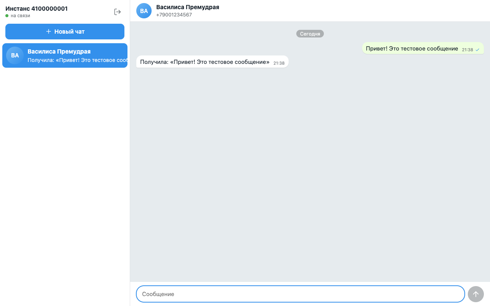
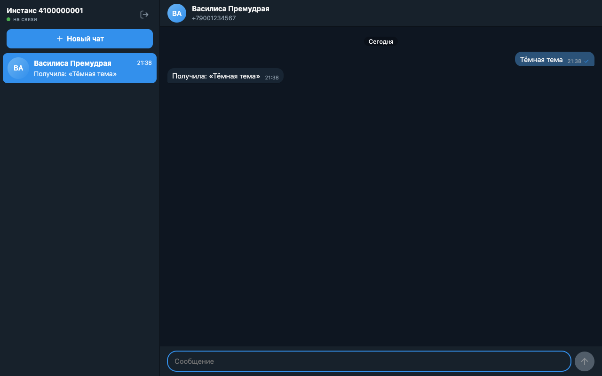
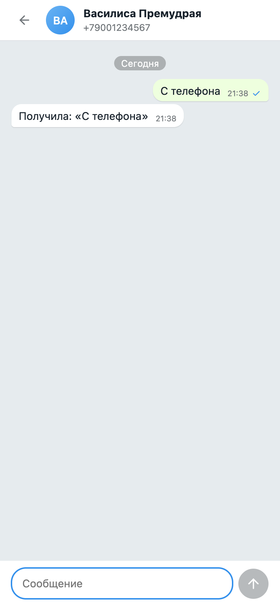

# Telegram-чат на GREEN-API

Простой веб-чат для отправки и получения текстовых сообщений в Telegram через
[GREEN-API](https://green-api.com/telegram). Интерфейс в духе web-клиентов мессенджеров:
список чатов слева, переписка справа, светлая и тёмная темы, адаптив под телефон.

**Демо:** https://aidamirrrrrr.github.io/green-api-telegram-react-test/

**Видео:** [docs/demo.mp4](docs/demo.mp4) (18 секунд, весь сценарий от входа до ответа собеседника)

React 19, TypeScript, Vite. Сторонних UI-библиотек нет.

<p>
  
</p>
<p>
  
  
  
</p>

## Что умеет

1. Вход по данным инстанса: `apiUrl`, `idInstance`, `apiTokenInstance`. Данные проверяются
   через `getStateInstance`.
2. Создание чата по номеру телефона: `checkAccount` находит аккаунт Telegram и его `chatId`.
3. Отправка текста методом [SendMessage](https://green-api.com/telegram/docs/api/sending/SendMessage/).
4. Получение ответов методами
   [ReceiveNotification и DeleteNotification](https://green-api.com/telegram/docs/api/receiving/technology-http-api/)
   (long polling).
5. История, непрочитанные и статусы отправки. Всё хранится в `localStorage` отдельно для каждого инстанса.

## Запуск локально

Нужен Node.js 20.19 или новее.

```bash
npm install
npm run dev
```

Откройте http://localhost:5173.

Остальные команды:

```bash
npm test         # тесты
npm run lint     # ESLint
npm run format   # Prettier
npm run build    # проверка типов и сборка в dist/
npm run preview  # раздать собранную версию
```

## Как подготовить настоящий инстанс

1. Зарегистрируйтесь в [личном кабинете](https://console.green-api.com) и создайте инстанс
   Telegram (тариф Developer бесплатный).
2. Авторизуйте инстанс: отсканируйте QR-код в приложении Telegram.
3. Скопируйте `apiUrl`, `idInstance` и `apiTokenInstance` со страницы инстанса.
4. В настройках инстанса включите уведомления о входящих сообщениях и оставьте `webhookUrl` пустым,
   иначе очередь `ReceiveNotification` будет пустой. Приложение проверяет это через `getSettings`
   и показывает предупреждение, но настройки сам не меняет: `setSettings` перезапускает инстанс.

## Как проверить сценарий

1. Войдите с данными инстанса.
2. Нажмите «Новый чат» и введите номер получателя в международном формате.
3. Отправьте сообщение: оно придёт получателю в Telegram.
4. Ответьте с телефона получателя: ответ появится в чате в течение нескольких секунд.

Тариф Developer ограничен тремя чатами и 100 проверками номеров. При превышении GREEN-API
отвечает кодом 466, приложение показывает понятное сообщение.

## Проверка без Telegram

В репозитории есть локальный мок GREEN-API. Он отвечает так же, как настоящий сервис, и
автоматически «отвечает» на каждое отправленное сообщение.

```bash
npm run mock
```

Затем войдите в приложение с такими данными:

| Поле | Значение |
| --- | --- |
| apiUrl | `http://localhost:8787` |
| idInstance | любые цифры |
| apiTokenInstance | любой, кроме `wrong` (он даёт ошибку авторизации) |

Номера, оканчивающиеся на `000`, «не имеют аккаунта». После трёх чатов мок отвечает кодом 466.

## Устройство

```
src/
  services/green-api.service.ts    клиент API (fetch) и ошибки, включая квоту тарифа (466)
  utils/notification.utils.ts      разбор тела уведомления в событие чата
  utils/                           телефон и форматирование дат
  hooks/use-notifications.hook.ts  цикл long polling с повтором при сбоях
  store/chat.reducer.ts            чаты, сообщения, непрочитанные, статусы отправки
  store/storage.utils.ts           сохранение в localStorage
  components/                      список чатов, окно переписки, формы входа и нового чата
scripts/mock-green-api.mjs         локальный мок GREEN-API
```

Код оформлен по конвенциям публичных проектов GREEN-API, например
[green-api-chat](https://github.com/green-api/green-api-chat): имена файлов `*.component.tsx`,
`*.hook.ts`, `*.utils.ts`, импорты от корня `src`, Prettier и ESLint с теми же правилами
(без `any`, порядок импортов).

Решения, которые стоит знать:

- Уведомление удаляется из очереди только после обработки. Если удаление не дошло, повторная
  доставка отбрасывается по `idMessage`, и дублей в чате нет.
- Эхо собственного сообщения (`outgoingAPIMessageReceived`) сливается с отправленным по
  `idMessage`, поэтому сообщение не двоится.
- При обрыве связи опрос повторяется с нарастающей паузой до 30 секунд. При неверных данных
  инстанса опрос останавливается и показывает ошибку.
- Неотправленное сообщение помечается причиной, его можно отправить повторно.
- Нетекстовые входящие сообщения показываются заглушкой: по заданию работаем только с текстом.
- Токен хранится в `localStorage` браузера. Кнопка выхода его удаляет.

## Настройка

Необязательная переменная в `.env` (см. `.env.example`): `VITE_GREEN_API_URL` задаёт `apiUrl`,
подставляемый в форму входа по умолчанию.
